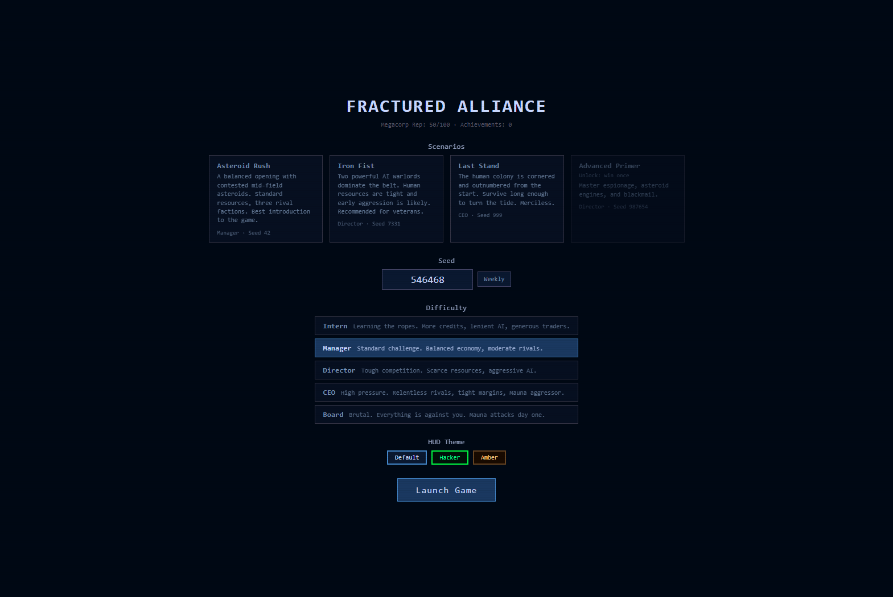
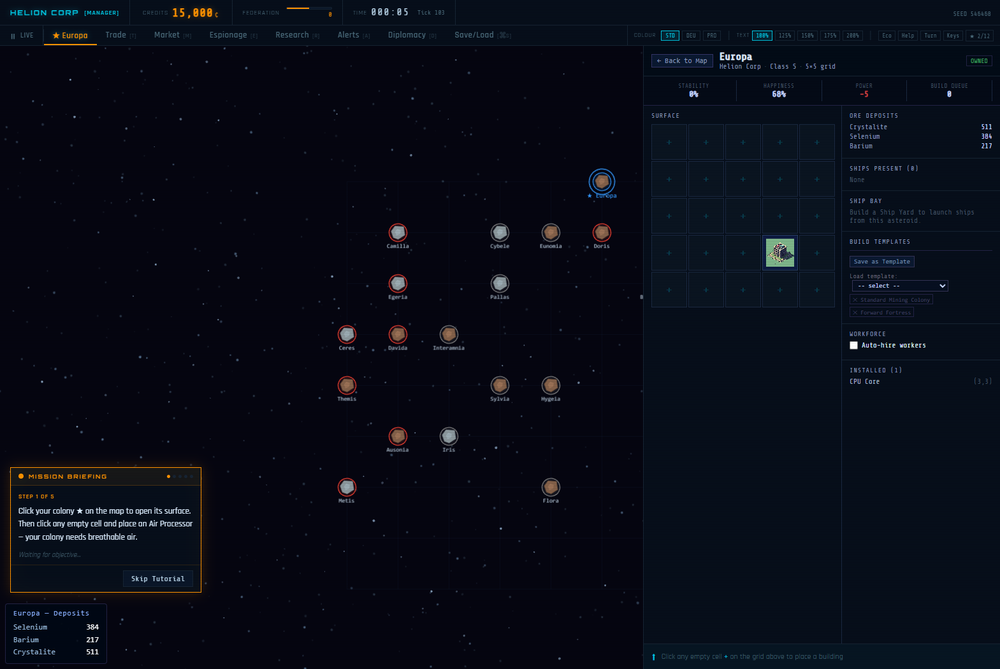
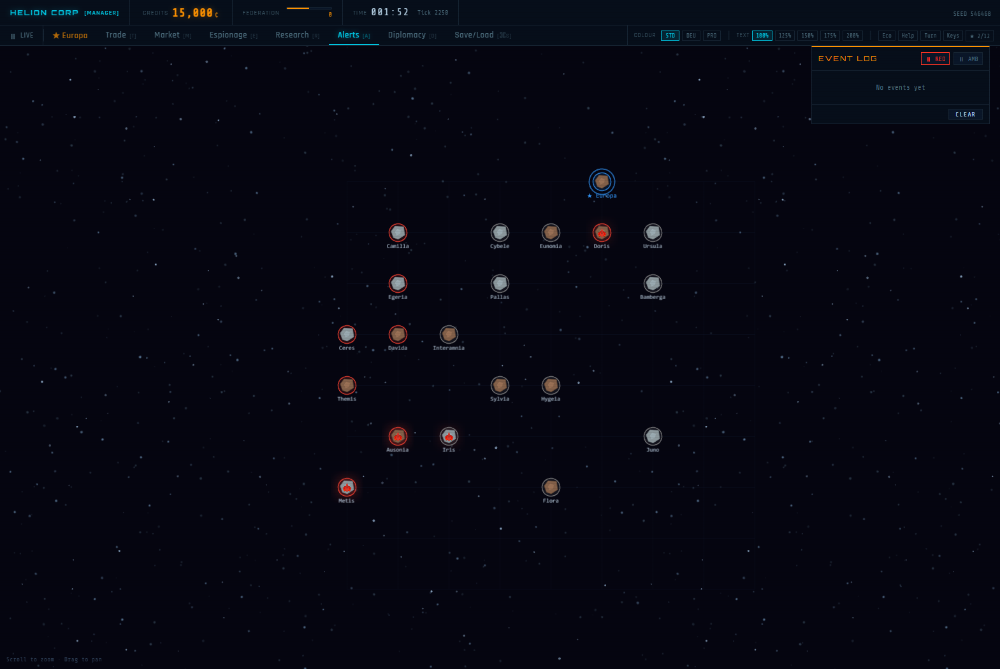
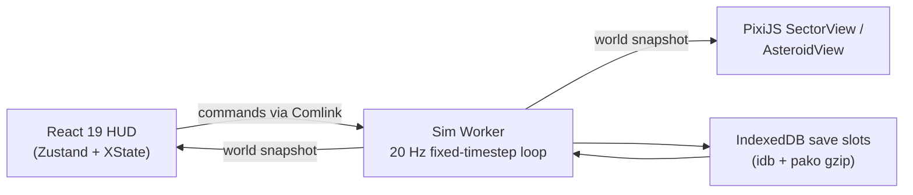

# Fractured Alliance

**A browser-native 4X colony sim set in a fractious asteroid belt.** Mine, build, trade, spy, and — if diplomacy fails — ram an enemy's asteroid into scrap.

[](https://github.com/brendankowitz/fracturedalliance-game/actions/workflows/ci.yml)
[](https://github.com/brendankowitz/fracturedalliance-game/actions/workflows/deploy-pages.yml)
[](LICENSE)


### ▶ [Play in your browser](https://brendankowitz.github.io/fracturedalliance-game/)

No install, no account, no download — it's a PWA and it works offline once loaded.

<p align="center">
  
</p>

## The Game

You're Helion Corp, a mining outfit with one asteroid, a scout, and a Federal charter that can be revoked the moment you step out of line. Around you drift six other factions — some in the Federation, some openly hostile — competing for the same ore-rich rocks. Colonize an asteroid, wire up life support before the crew suffocates, dig for ore, and sell it to the monthly Federal transporter, a passing merchant, or the black market if you're willing to risk your license. Reinvest in blueprints, grow your fleet, sign treaties you might later break, and decide whether you stay a loyal contractor or make a run at independence.

A match runs at a real-time pace with variable speed (or a turn-based "slow-sim" mode if you'd rather think between ticks), and ends when you hit one of five victory conditions: eliminate every rival empire, bank 1,000,000 credits, max out Federation standing, own every blueprint in the game, or hold more than half the belt's surviving asteroids.

<p align="center">
  
</p>

### Colonize & build

- 57 building types across life support, mining, power, logistics, defense, and production, placed on a size-scaled surface grid (5×5 up to 11×11)
- Ore deposits per asteroid across 10 ore types, mined by tiered mines and multiplied by refineries
- Per-asteroid and global build queues, save-as-template workflows, and budget-capped auto-hire for colony supervisors

### Economy & trade

- Sell to the monthly Federal Ore Transporter, dock independent merchants, or risk the Black Market — which tracks a suspicion meter that can trigger a Federation license revocation and a punitive expedition
- Ore prices drift per match and carry race-specific demand modifiers

### Diplomacy & espionage

- Seven treaty types with AI grudge memory, so provoking a rival for easy cash stops working after the first few times
- A roster of 20 espionage agents running recon, tech-steal, sabotage, blackmail, and colony-liberation missions, plus spy satellites launched from a Satellite Silo

<p align="center">
  
</p>

### Military

- Six ship classes from Scout up through Destructor and Command Cruiser, missile silos for long-range bombardment, and turrets that auto-fire on attackers
- The Asteroid Engine: bolt enough engines onto your own rock and fly it into an enemy's — telegraphed, costly, and counterable with a Gravity Nullifier, but still an apocalyptic climax when it lands

### AI & races

- Six AI factions (Kryll Collective, Motkaj, Achar, Brakkat, Rigal, and the Federation-outlaw Mauna), each with a personality vector and a signature trait — Kryll presses accusations, Motkaj breaks pacts first, Brakkat double-retaliates, Rigal undercuts tech-steal costs, and so on
- AI empires scout and settle unclaimed asteroids on their own, not just react to the player

### Progression & replay

- 44 blueprints across four disciplines with tier-2 prerequisites
- Five difficulty presets (Intern → Board) and four scenarios — Asteroid Rush, Iron Fist, Last Stand, and an Advanced Primer that unlocks after your first match
- A user-visible seed for procedurally generated belts, a weekly community seed, 12 achievements, three HUD themes, and a megacorp reputation that persists across matches

### Accessibility & UX

- WCAG-minded colorblind palettes, text scaling, full remappable keybinds with conflict detection, and ARIA-live alert announcements
- A gated interactive tutorial, contextual help tooltips on HUD elements, and configurable pause-on-event behavior

## Getting Started

**Prerequisites:** Node.js 22+, pnpm 9

```bash
pnpm install     # install workspace dependencies
pnpm dev         # launch the web app (Vite dev server)
pnpm build       # production build of the web app
pnpm test        # run the vitest suite across every workspace
pnpm lint        # biome check .
```

A Tauri desktop build is also available:

```bash
pnpm build:desktop
```

## Architecture

The game simulation is deterministic TypeScript running in a Web Worker; the main thread only renders and sends commands.



Each render frame, the main thread accumulates elapsed time, drains any queued player commands into the worker over a Comlink RPC proxy, ticks the simulation at a fixed 50&nbsp;ms step, then pulls a fresh snapshot back into a Zustand store (for the HUD) and the active PixiJS view (for the belt map or asteroid surface). Because the sim only reads from its own state, a seeded PRNG, and the queued commands, the same seed and command log always replay to the same world — the basis for the deterministic replay tests in `packages/sim`.

| Workspace | Purpose |
|---|---|
| `apps/web` | The game client — React 19 HUD, PixiJS world rendering, Zustand stores, XState game/tutorial flow machines, Vite + `vite-plugin-pwa` |
| `apps/desktop` | Tauri 2.0 desktop wrapper around `apps/web`, with native save export/import |
| `packages/domain` | Plain TypeScript types for the game's data model — `World`, `Asteroid`, `Ship`, `Player`, `Treaty`, and friends. No logic |
| `packages/sim` | The deterministic simulation: mining, economy, combat, diplomacy, espionage, AI, and victory systems, a seeded PRNG, and the `SimApi` exposed to the worker via Comlink |
| `packages/content` | Game content as versioned JSON with runtime validation — buildings, blueprints, ores, ships, agents, races, and scenarios |
| `packages/persistence` | Save/load: IndexedDB via `idb`, gzip via `pako`, schema-versioned saves with migrations |

## Project Layout

```
fracturedalliance-game/
├── apps/
│   ├── web/          # the game client (Vite + React + PixiJS)
│   └── desktop/      # Tauri desktop wrapper
├── packages/
│   ├── domain/       # data model types
│   ├── sim/          # deterministic simulation engine
│   ├── content/      # buildings, blueprints, races, scenarios (JSON)
│   └── persistence/  # save/load
├── docs/             # design spec, feature plans, media
└── package.json      # workspace root
```

## Credits

- **Art:** [Kenney.nl](https://kenney.nl) CC0 sprite packs (meteors, planets, ships, buildings, effects, UI)
- **Fonts:** [Orbitron](https://fonts.google.com/specimen/Orbitron), [Share Tech Mono](https://fonts.google.com/specimen/Share+Tech+Mono), and [Rajdhani](https://fonts.google.com/specimen/Rajdhani) via Google Fonts
- **Audio:** original SFX and music tracks under `apps/web/public/audio`

## License

MIT — see [LICENSE](LICENSE).
